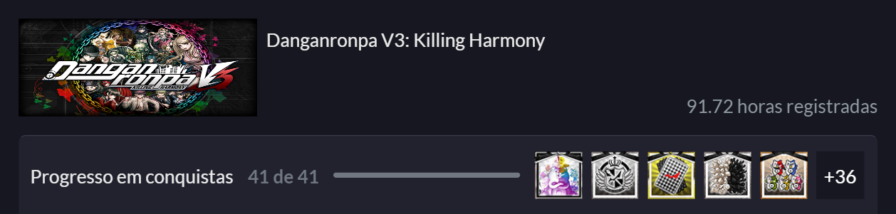

  <h2 align="center">Otocyon-cli</h2>
<!-- 	<h1 align="center"></h1> -->

## :thinking: What is this?

An CLI to gen game "badges" using [otocyon.herokuapp.com](otocyon.herokuapp.com/)

## :rocket: Techs used

- **TypeScript** - A Superset for JavaScript
- **gluegun** - A toolkit for building TypeScript-powered command-line apps

## :fire: Getting started
Sometimes I leave it the server on air hosted by Heroku in this endpoint: https://otocyon.herokuapp.com/, but may you need to run otocyon locally. For this, follow instructions on server repo: [Otocyon server](https://github.com/matheus2x/otocyon)

Assuming you can have access to the server, follow the nexts steps: 

1. Clone this repo with `$ git clone https://github.com/matheus2x/otocyon-cli.git`
3. Move yourself to repo with `$ cd otocyon-cli`
4. Run `$ yarn` to install dependencies
5. Create an `.env` file and put yours env files
6. Run `$ yarn build` to gen bundle files
7. Run `$ yarn link` to link commands
  

## :orange_book: CLI Usage

* [Steam](#steam)
	* [gen-badge](#2)
* [Xbox]
	* Comming soon...

  

# Steam

## gen-badge-steam

Run `$ otocyon-cli gen-badge-steam <steamProfileID> <steamGameID>`

Param|Required|Description|Example
---|---|---|---
steamProfileID|Yes|Steam Profile ID|76561198104651572
steamGameID|Yes|Steam Game ID|567640
 

Example of canvas badge generated (HTML generated available on models dir):  

[> Back to the top <](#top-document)

  

---

<h4 align="center">
    Made with :fox_face: by <a href="https://www.linkedin.com/in/matheus2x/" target="_blank">Matheus Henrique</a>
</h4>
